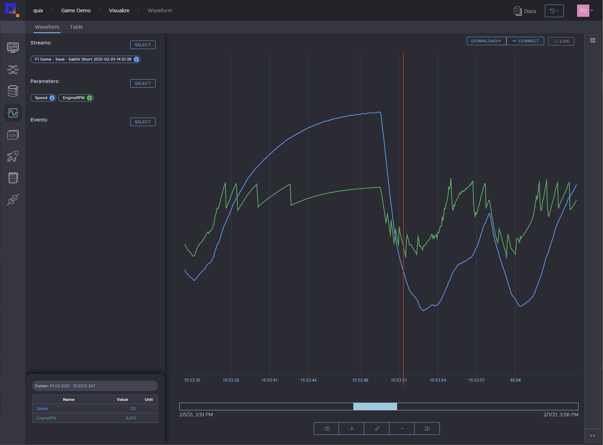

# Quix car data sample code
Python example code how to write car telemetry data into Quix platform. Example file ([cardata.csv](source/cardata.csv)) provided is telemetry from F1 car in **Codemaster 2019 racing game**. 

## Get started
Sign up for free account in Quix platform [here](https://portal.platform.quix.ai/self-sign-up). Create a workspace and then a topic inside. 


You can deploy this code directly to Quix serveless environment or setup local Python environment. 

Local Python environment setup:
 - [Windows](README_Windows.md)
 - [Mac](README_Mac.md)
 - [Linux](README_Linux.md)

## Code

Set up connection to broker and open connection to your topic

```python
# Create a client factory. Factory helps you create StreamingClient (see below) a little bit easier
security = SecurityOptions('../certificates/ca.cert', "<USERNAME>", "<PASSWORD>")
client = StreamingClient('<BROKER_ADDRESS>', security)

# Open output topic connection.
output_topic = client.open_output_topic('ORGANIZATION-WORKSPACE-TOPICNAME')
```

Then we create new stream in topic:

```python
stream = output_topic.create_stream()
```

A stream is a collection of data that belong to a single session of a single source. For example single car journey.

If you don't specify stream id, random guid is generated. Specify it if you want append data into the stream later.
`stream = output_topic.create_stream("my-own-stream-id")`

Give the stream human readable name. This name will appear in data catalogue.
```python
stream.properties.name = "cardata"
```

Read csv file into data frame.
```python
df = pd.read_csv("cardata.csv")
```

Write data frame to output topic.
```python
stream.parameters.write(df)
```

Stream can be infinitely long or have start and end.
If you send data into closed stream, it is automatically opened again.
```python
stream.close()
```

More about how to use Quix SDK to write data into Quix, see our documentation: [Writting to Quix DOC](https://documentation-40c5b57b-a938-4925-93a9-25df5a64e54f.platform.quix.ai/sdk/python-how-to/#writing-to-quix)

### Full code example:
[source/main.py](source/main.py)

## End result
After car data is successfully streamed to Quix platform you can analyse it using Visualize page in Quix.

[](quix.png "Visualize in Quix") 
